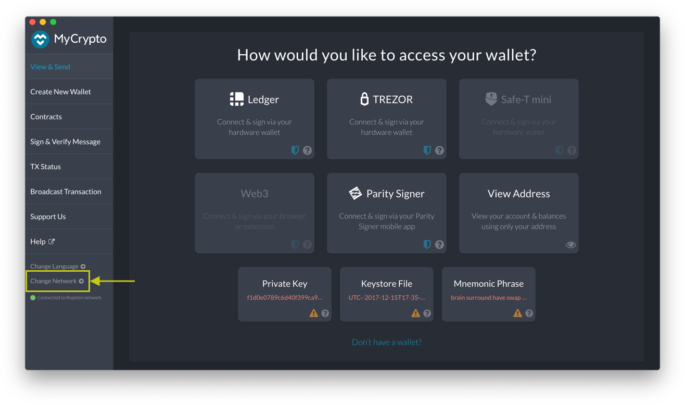
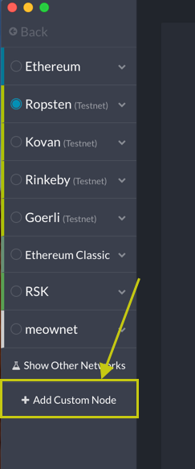
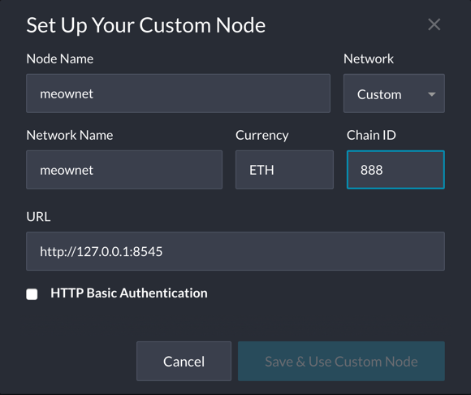
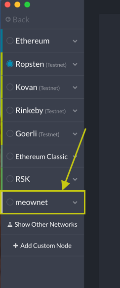
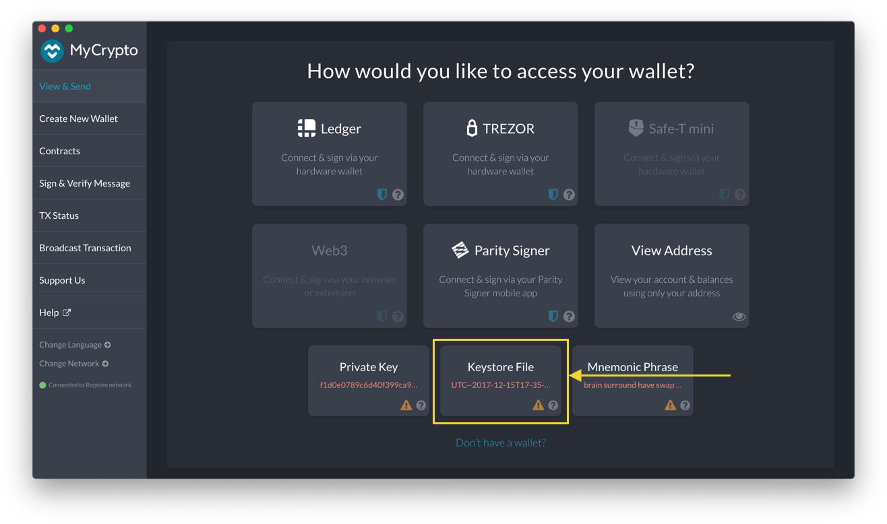
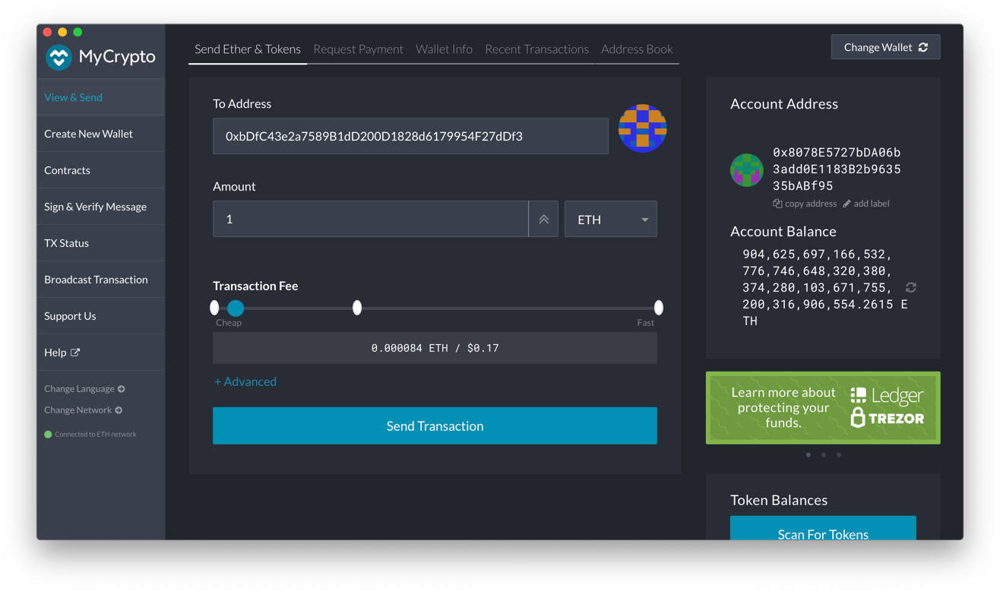
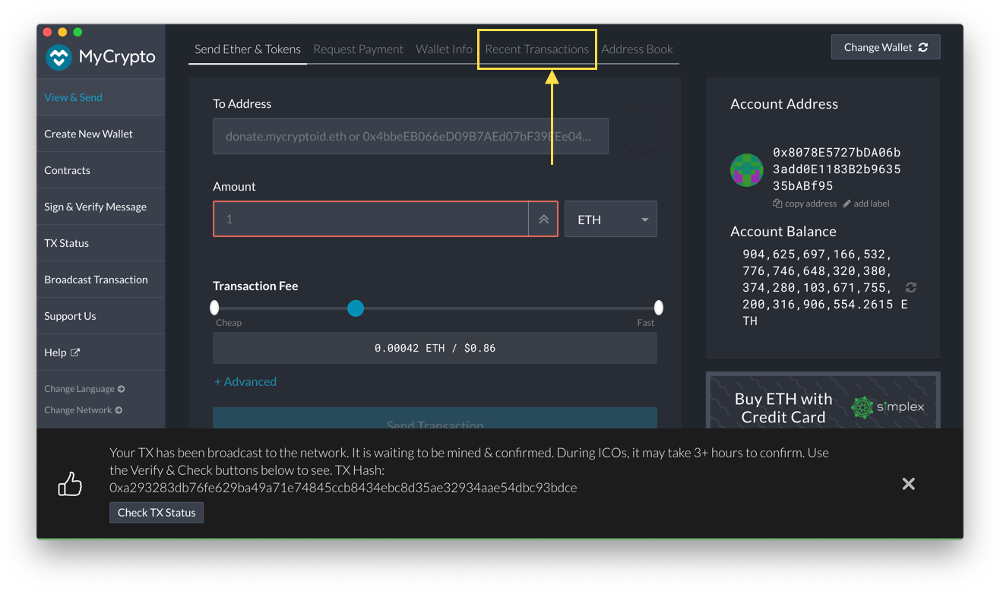
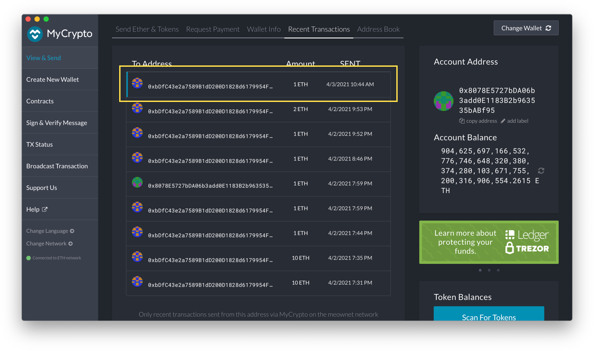
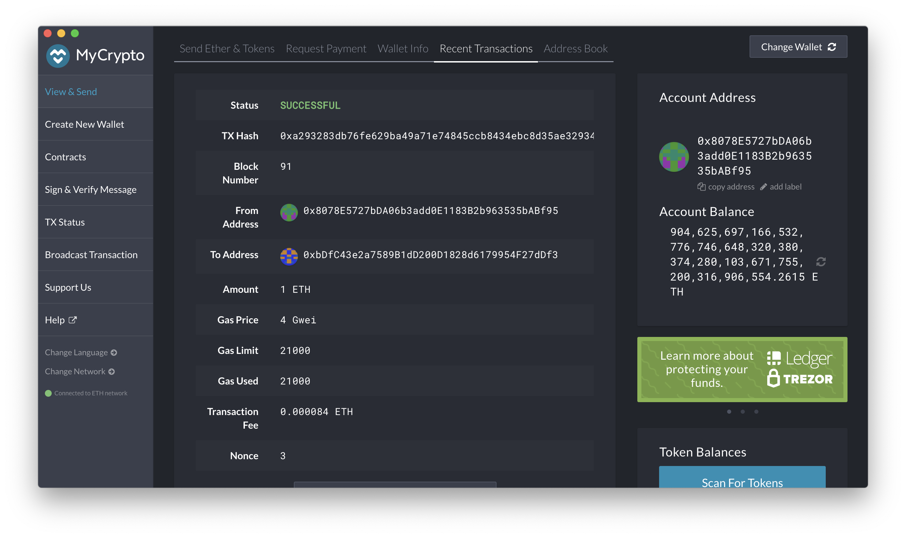

# meownet

A network for cats and feline-friendly humans.

## Running and Using the Network

### Installation

To run the network, you'll need to download and install [MyCrypto](https://app.mycrypto.com/download-desktop-app) and the [Go Ethereum Tools version 1.9.7](https://geth.ethereum.org/downloads/).

Unpack/unzip the Go Ethereum Tools archive file and rename the folder to "Blockchain-Tools". Move the folder to a convenient location that you can reference later in the command line.

**Mac OSX Troubleshooting.** If you encounter issues with opening MyCrypto or running the Go Ethereum tools due to an unidentified developer error, try this [Apple support page](https://support.apple.com/guide/mac-help/protect-your-mac-from-malware-mh40596/11.0/mac/11.0) to get it fixed.

The network was configured with the following options:
- Blocktime - 15 seconds (default). This is the amount of time to produce a new block.
- Chain ID - 888. The chain ID is part of the transaction signing process and protects against transaction replay attacks.
- Ports: 30303 (node1) and 30304 (node2). These are the apartment numbers of an address that the nodes are listening on for messages from other nodes.
- Accounts: Two accounts have been created for the network: node1 and node2. The keystores for these accounts are stored in `node1/keystore` and `node2/keystore`. You can use the keystore files in MyCrypto to unlock the account wallets. Both accounts can seal blocks and both accounts were prefunded with 1 wei.

### Start Nodes

Run each command below in its own terminal. Hit `Enter` when prompted for the password as there is no password.

**Terminal 1**

```
geth --datadir node1 --unlock "0x8078e5727bda06b3add0e1183b2b963535babf95" --mine --rpc --allow-insecure-unlock --ipcdisable
```

**Terminal 2**

```
geth --datadir node2 --unlock "0xbdfc43e2a7589b1dd200d1828d6179954f27ddf3" --mine --port 30304 --bootnodes "enode://ba9a4cab0efc0e6b2157e1cbb851d31374e33bddf484379ffbfd1b1cbe8a6e3c508fd198f8bbf2ca43e8d1b85b4ab01bc3f50e3c4c9e91fb7970be66a072e6ee@127.0.0.1:30303" --allow-insecure-unlock
```

Command parameters:
- `--datadir` - the data directory for the node databases and keystore
- `--unlock` - the account to unlock
- `--mine` - enable mining on the node
- `--port` - the network port to listen on
- `--bootnodes` - the enode URL for bootstrapping P2P discovery
- `--allow-insecure-unlock` - allow insecure account unlocking
- `--rpc` - start the RPC interface. This allows programs to call procedures on a remote machine.
- `--ipcdisable` - disable the IPC-RPC server on Windows

### Configure MyCrypto

To use **meownet**, you'll have to add it as a custom network to MyCrypto. In MyCrypto, click "Change Network" and then click "+ Add Custom Node":





Configure the network as follows:



Finally, change to the **meownet** network. You may need to restart MyCrypto if you're unable to switch.



### Test the Network

To test out the network, send a transaction from the node1 account to the node2 account (address is `0xbDfC43e2a7589B1dD200D1828d6179954F27dDf3`). Make sure you have the "meownet" network selected.

Access the node1 account wallet using the [node1 keystore file](node1/keystore/UTC--2021-04-03T02-21-16.575718000Z--8078e5727bda06b3add0e1183b2b963535babf95) in the `node1/keystore` folder.



Send 1 ETH to the node2 account by filling out the form as follows. Use address `0xbDfC43e2a7589B1dD200D1828d6179954F27dDf3`.



Once you send the transaction, you can view recent transactions and the status of your latest transaction.





